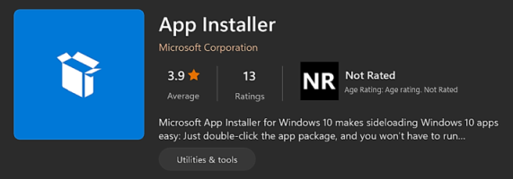
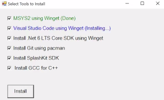
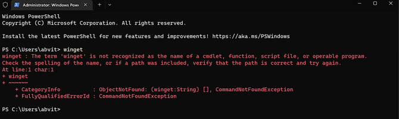
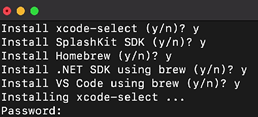
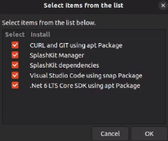

# SplashKit All-In-One (AIO) installer

The shell script aio-install.sh contain commands that install SplashKit and all related tools on Windows, MacOS, and Ubuntu. See the installation demo [here](https://video.deakin.edu.au/media/t/1_ybysuvjw).

## Table of Contents

1. [Start Installation](#start-installation)
   - [Windows](#windows)
   - [MacOS](#macos)
   - [Ubuntu](#ubuntu)
2. [Windows](#windows-1)
   - [Installation Interface](#installation-interface)
   - [Issues](#issues)
3. [MacOS](#macos-1)
   - [Xcode](#xcode)
   - [SplashKit SDK](#splashkit-sdk)
   - [Brew](#brew)
   - [Installation Interface](#installation-interface-1)
4. [Ubuntu](#ubuntu-1)
   - [Installation Interface](#installation-interface-2)
5. [Uninstall](#uninstall)
   - [Windows](#windows-2)
   - [MacOS](#macos-2)
   - [Ubuntu](#ubuntu-2)

## Start Installation

### Run the following in the terminal to start installing

> ### Windows
>
> ```
> iex ((New-Object System.Net.WebClient).DownloadString('https://raw.githubusercontent.com/thoth-tech/splashkit-aio/main/aio-install.sh'))
> ```
>
> ### MacOS
>
> ```
> bash <(curl -s https://raw.githubusercontent.com/thoth-tech/splashkit-aio/main/aio-install.sh)
> ```
>
> ### Ubuntu
>
> ```
> wget https://raw.githubusercontent.com/thoth-tech/splashkit-aio/main/aio-install.sh -O - | bash
> ```

## Windows

The installer uses [Winget](https://github.com/microsoft/winget-cli) (Windows Package Manager) to install [MSYS2](https://www.msys2.org/), [VS Code](https://code.visualstudio.com/), and [.Net 6 LTS Core SDK](https://dotnet.microsoft.com/en-us/download) on Windows using PowerShell command line. According to Winget’s [documentation](https://docs.microsoft.com/en-us/windows/package-manager/winget/), the command line tool is bundled with Windows 11 and modern versions of Windows 10 by default as the [App Installer](https://apps.microsoft.com/store/detail/app-installer/9NBLGGH4NNS1?hl=en-us&gl=us).



After installing **MSYS2**, the script can now allow the PowerShell command line to execute bash scripts with MSYS2 by using the [bash invoke commands](https://www.gnu.org/software/bash/manual/html_node/Invoking-Bash.html) `-l` or `--login`, which allows execution to be run by the MYSY2 shell, and `-c`, which run the commands enclosed within the double quotation, e.g. `$ bash -l -c "<command_here>"`. The script can now install **Git**, **SplashKit SDK**, and **GCC for C++** using MSYS2 through PowerShell.

### Installation Interface

The script displays a Checkbox to allow a selection of tools to install. The script creates [.Net objects](https://docs.microsoft.com/en-us/powershell/scripting/samples/creating-.net-and-com-objects--new-object-?view=powershell-7) in Powershell and uses the namespace `System.Windows.Forms` to represent [CheckBox objects](https://docs.microsoft.com/en-us/dotnet/api/system.windows.forms.checkbox?view=windowsdesktop-6.0).



### Issues

Some Windows computers may not recognise Winget when executed in the PowerShell command line due to issues regarding conflict in Windows environment variables. To solve the [issue](https://github.com/microsoft/winget-cli/issues/725), the script calls Winget directly from its default location using the command `& "$env:LOCALAPPDATA\Microsoft\WindowsApps\winget"` as stated in the [troubleshooting](https://github.com/microsoft/winget-cli/tree/master/doc/troubleshooting) guide.



## MacOS

### Xcode

The script starts by executing the command `xcode-select --install` to install the [Xcode](https://mac.install.guide/commandlinetools/4.html) command line tool. If an existing Xcode directory exists, the script deletes it first, then creates a new one during installation.

### SplashKit SDK

After installing the Xcode command line, the script proceeds to install [SplashKit SDK](https://splashkit.io/articles/installation/mac/step-2/)

### Brew

The script installs the [Brew](https://brew.sh/) Package Manager to install [VS Code](https://code.visualstudio.com/) and [.Net 6 LTS Core SDK](https://dotnet.microsoft.com/en-us/download) using the command line.

### Installation Interface

The installation process for MacOS is entirely within the command-line.



## Ubuntu

The script uses Ubuntu's default package manager [APT](https://wiki.debian.org/Apt) to install **Git** and **Curl**, which are needed to install [SplashKit Manager](https://splashkit.io/articles/installation/ubuntu/step-1/). After installing the manager, the script installs all other **SplashKit Linux dependencies**. Afterward, the script uses the [SNAP](https://snapcraft.io/) package to install [VS Code](https://code.visualstudio.com/) and **APT** to install [.Net 6 LTS Core SDK](https://dotnet.microsoft.com/en-us/download).

### Installation Interface

The script uses the tool [Zenity](https://manpages.ubuntu.com/manpages/trusty/man1/zenity.1.html) to display a Checkbox and allow a selection of tools to install. Zenity is by default included with the Gnome desktop, such as Ubuntu and other Linux distros.



## Uninstall

### Run the following in the terminal to uninstall.

> ### Windows
>
> ```
> iex ((New-Object System.Net.WebClient).DownloadString('https://raw.githubusercontent.com/thoth-tech/splashkit-aio/main/uninstall.sh'))
> ```
>
> ### MacOS
>
> ```
> bash <(curl -s https://raw.githubusercontent.com/thoth-tech/splashkit-aio/main/uninstall.sh)
> ```
>
> ### Ubuntu
>
> ```
> wget https://raw.githubusercontent.com/thoth-tech/splashkit-aio/main/uninstall.sh -O - | bash
> ```
